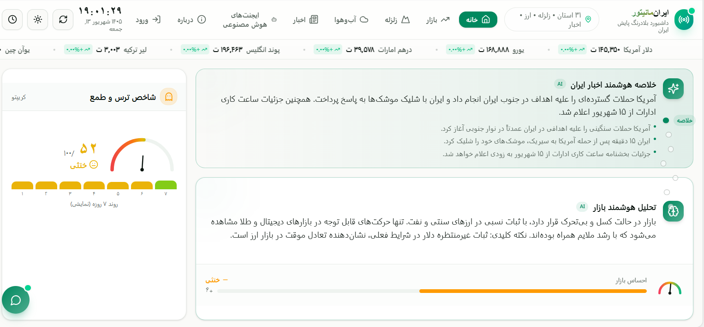
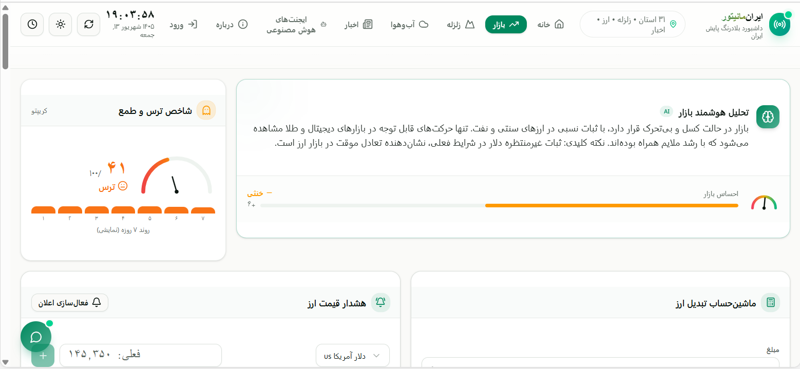
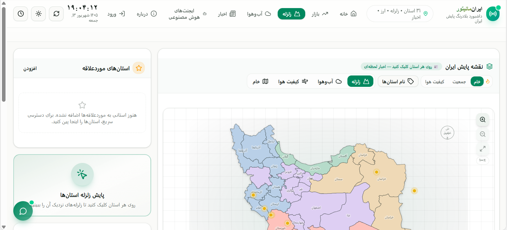
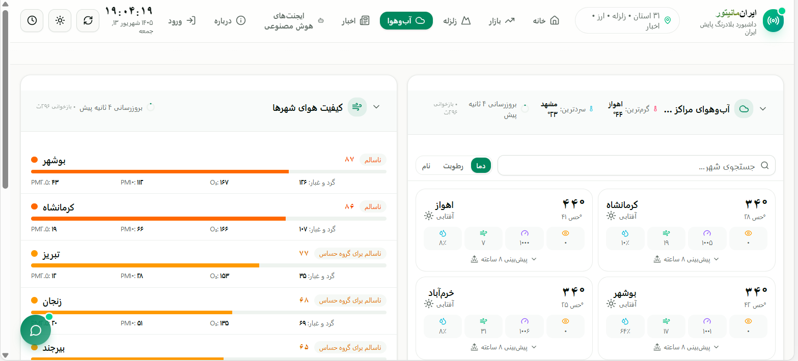
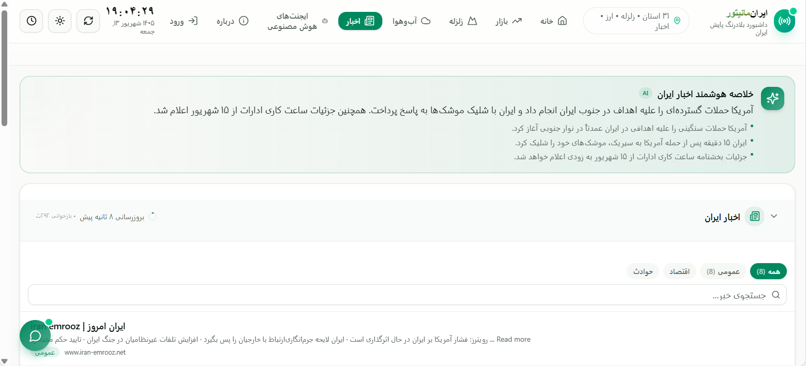
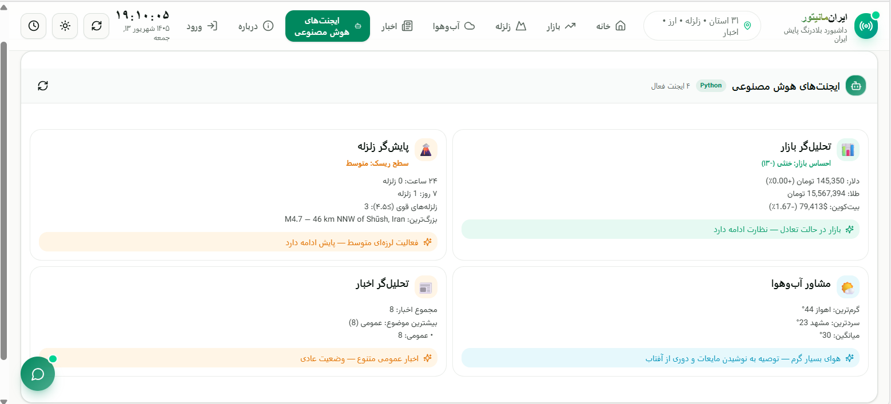

# 🇮🇷 ایران‌مانیتور — IranMonitor

> داشبورد بلادرنگ پایش ایران — زلزله، آب‌وهوا، کیفیت هوا، نرخ ارز، کریپتو، اخبار و ایجنت‌های هوش مصنوعی

[](https://nextjs.org/)
[](https://www.typescriptlang.org/)
[](https://fastapi.tiangolo.com/)
[](https://tailwindcss.com/)

ایران‌مانیتور یک پلتفرم جامع پایش لحظه‌ای ایران است که الهام گرفته از پروژه [worldmonitor](https://github.com/koala73/worldmonitor) است و به‌جای تمرکز بر کل جهان، روی **نقشه و داده‌های ایران** متمرکز شده.

---

## 📑 فهرست

- [✨ ویژگی‌ها](#-ویژگی‌ها)
- [🏗️ معماری پروژه](#-معماری-پروژه)
- [📋 پیش‌نیازها](#-پیش‌نیازها)
- [🚀 نصب و اجرا (گام‌به‌گام)](#-نصب-و-اجرا-گام‌به‌گام)
- [⚙️ تنظیمات](#-تنظیمات)
- [📊 منابع داده](#-منابع-داده)
- [🔧 فناوری‌ها](#-فناوری‌ها)
- [📁 ساختار پروژه](#-ساختار-پروژه)
- [❓ سوالات متداول](#-سوالات-متداول)
- [📝 لایسنس](#-لایسنس)

---

## ✨ ویژگی‌ها

### 🗺️ نقشه تعاملی ایران
- نقشه SVG تمام ۳۱ استان ایران با d3-geo
- زوم/پان با موس و دکمه‌های کنترلی
- ۴ لایه داده: زلزله، آب‌وهوا، کیفیت هوا، خام
- نقشه حرارتی: جمعیت / کیفیت هوا
- برچسب فارسی استان‌ها روی نقشه
- کلیک روی هر استان → اخبار لحظه‌ای + آب‌وهوا + زلزله‌های نزدیک

### 📡 داده‌های زنده (همه رایگان، بدون کلید API)
| داده | منبع | توضیح |
|------|------|-------|
| زلزله | USGS API | ۳۰ روز اخیر، فیلتر شده برای ایران |
| آب‌وهوا | wttr.in | ۳۱ مرکز استان + پیش‌بینی ۳ روزه |
| کیفیت هوا | Open-Meteo AQI | PM2.5/PM10/O3/گرد و غبار |
| نرخ ارز | open.er-api.com | نرخ واقعی (IRR/USD/EUR/...) |
| طلا | gold-api.com | قیمت لحظه‌ای طلا و نقره |
| کریپتو | CoinGecko | ۸ ارز دیجیتال با sparkline |
| اخبار استان | RSS خبرگزاری‌ها | مهر، ایسنا، مشرق |
| کالاها | gold-api +估算 | نفت، مس، فولاد، گندم |

### 🤖 ایجنت‌های هوش مصنوعی (Python FastAPI)
چهار ایجنت تخصصی که داده‌های زنده را تحلیل می‌کنند:

| ایجنت | حوزه | خروجی |
|--------|------|-------|
| 📊 تحلیل‌گر بازار | ارز/کریپتو/کالا | شاخص احساس بازار + توصیه |
| 🌋 پایش‌گر زلزله | زلزله | سطح ریسک + آمار ۲۴ساعته/۷روزه |
| 🌤️ مشاور آب‌وهوا | آب‌وهوا | گرم‌ترین/سردترین + توصیه سفر |
| 📰 تحلیل‌گر اخبار | اخبار | دسته‌بندی + موضوع غالب |

### 📄 چند صفحه‌ای
- **خانه** — داشبورد کامل با همه پنل‌ها
- **بازار** — ابزار مالی (مبدل ارز، هشدار قیمت، سبد دارایی)
- **زلزله** — نقشه + پنل زلزله
- **آب‌وهوا** — آب‌وهوا + کیفیت هوا + پیش‌بینی
- **اخبار** — خلاصه هوشمند + اخبار + اخبار استان
- **ایجنت‌ها** — پنل ایجنت‌های هوش مصنوعی
- **درباره** — معرفی پروژه
- **ورود** — ورود/ثبت‌نام

### 🛠️ ابزارها
- **مبدل ارز** — تبدیل ۱۲ ارز + تومان
- **هشدار قیمت** — تنظیم آستانه + نوتیفیکیشن مرورگر
- **سبد دارایی** — محاسبه سود/زیان لحظه‌ای
- **مقایسه استان‌ها** — مقایسه ۳ استان
- **مقایسه دارایی** — نمودار دو دارایی
- **مقایسه آب‌وهوا** — مبدا/مقصد برای سفر
- **چت هوشمند** — پرسش‌وپاسخ با داده زنده
- **تقویم اقتصادی** — رویدادهای جهانی

### 🎨 رابط کاربری
- تم تاریک/روشن + حالت خودکار بر اساس ساعت
- ریسپانسیو (موبایل/تبلت/دسکتاپ)
- منوی همبرگری در موبایل
- نوار تیکر متحرک قیمت‌ها
- RTL فارسی کامل با فونت Vazirmatn
- کنترل+ک برای جستجوی استان
- Drag-and-drop برای جابجایی پنل‌ها
- Collapsible پنل‌ها
- استان‌های موردعلاقه (pin)
- لینک اشتراک‌گذاری با استان انتخاب‌شده

---


---

## 📸 پیش‌نمایش پروژه

<table align="center">
  <tr>
    <td align="center">
      <br />
      <b>🏠 صفحه اصلی</b>
    </td>
    <td align="center">
      <br />
      <b>📊 بازار</b>
    </td>
  </tr>
  <tr>
    <td align="center">
      <br />
      <b>🌍 زلزله</b>
    </td>
    <td align="center">
      <br />
      <b>☀️ آب و هوا</b>
    </td>
  </tr>
  <tr>
    <td align="center">
      <br />
      <b>📰 اخبار</b>
    </td>
    <td align="center">
      <br />
      <b>🤖 هوش مصنوعی</b>
    </td>
  </tr>
</table>

---


## 🏗️ معماری پروژه

پروژه از **دو سرویس** تشکیل شده که کنار هم کار می‌کنند:

```
┌──────────────────────────────────────────────────────────────┐
│                        مرورگر کاربر                            │
│                   (Next.js Frontend — پورت ۳۰۰۰)               │
│  ┌──────────┐  ┌──────────┐  ┌──────────┐  ┌──────────┐     │
│  │  نقشه    │  │  پنل‌ها  │  │  ابزارها │  │  چت AI  │     │
│  └────┬─────┘  └────┬─────┘  └────┬─────┘  └────┬─────┘     │
│       └─────────────┴────────────┴───────────────┘            │
│                         │  API Calls                        │
│  ┌──────────────────────┴─────────────────────────┐          │
│  │            Next.js API Routes (پورت ۳۰۰۰)        │          │
│  │  earthquakes │ weather │ airquality │ currency  │          │
│  │  crypto │ commodities │ news │ province-news    │          │
│  │  news-summary │ market-insights │ chat           │          │
│  │  python-agents (proxy) │ python-chat (proxy)    │          │
│  └──────────────────────┬─────────────────────────┘          │
│                         │                                     │
│  ┌──────────────────────┴─────────────────────────┐          │
│  │     منابع داده خارجی (همه رایگان)               │          │
│  │  USGS │ wttr.in │ Open-Meteo │ CoinGecko       │          │
│  │  open.er-api │ gold-api │ RSS خبرگزاری‌ها       │          │
│  │  z-ai SDK (LLM + web_search)                    │          │
│  └────────────────────────────────────────────────┘          │
└──────────────────────────────────────────────────────────────┘
                         │
          ┌──────────────┴──────────────┐
          │   Python FastAPI (پورت ۸۰۰۰) │
          │  ┌──────────────────────┐    │
          │  │  ۴ ایجنت هوش مصنوعی │    │
          │  │  تحلیل‌گر بازار      │    │
          │  │  پایش‌گر زلزله       │    │
          │  │  مشاور آب‌وهوا      │    │
          │  │  تحلیل‌گر اخبار      │    │
          │  └──────────────────────┘    │
          └───────────────────────────────┘
```

### دو بک‌اند
| بخش | زبان | پورت | توضیح |
|------|------|------|-------|
| فرانت‌اند + API داده | TypeScript/Next.js | ۳۰۰۰ | داده‌های زنده، اخبار RSS، نرخ ارز واقعی |
| ایجنت‌های هوش مصنوعی | Python/FastAPI | ۸۰۰۰ | تحلیل بازار، زلزله، آب‌وهوا، اخبار |

> **نکته:** سرویس پایتون **اختیاری** است. بدون آن هم داشبورد کار می‌کند، فقط پنل ایجنت‌های هوش مصنوعی غیرفعال می‌شود.

---

## 📋 پیش‌نیازها

| نرم‌افزار | حداقل نسخه | لینک دانلود |
|-----------|------------|-------------|
| Node.js | ۱۸+ | [nodejs.org](https://nodejs.org/) |
| Bun | ۱+ | [bun.sh](https://bun.sh/) |
| Python | ۳.۱۰+ | [python.org](https://python.org/) |
| Git | ۲.۳۰+ | [git-scm.com](https://git-scm.com/) |

**سیستم‌عامل:** Linux، macOS یا Windows (WSL)

---

## 🚀 نصب و اجرا (گام‌به‌گام)

### مرحله ۱: کلون کردن پروژه

```bash
git clone https://github.com/YOUR_USERNAME/iran-monitor.git
cd iran-monitor
```

### مرحله ۲: نصب وابستگی‌های Node.js

```bash
bun install
```

> اگر `bun` ندارید، نصب کنید: `curl -fsSL https://bun.sh/install | bash`
>
> یا می‌توانید از npm استفاده کنید: `npm install`

### مرحله ۳: تنظیم متغیرهای محیطی

```bash
# کپی فایل نمونه
cp .env.example .env
```

فایل `.env` رو با ویرایش‌گر متن باز کنید و مطمئن شوید مسیر دیتابیس درست است:

```env
# مسیر فایل دیتابیس SQLite (نسبی به ریشه پروژه)
DATABASE_URL="file:./db/custom.db"
```

> **نکته:** برای ساخت دیتابیس اولیه:
> ```bash
> bun run db:push
> ```
> این دستور فایل SQLite رو با schema پیش‌فرض می‌سازد.

### مرحله ۴: نصب وابستگی‌های Python (اختیاری — برای ایجنت‌های هوش مصنوعی)

```bash
cd mini-services/iran-monitor-api
pip install -r requirements.txt
cd ../..
```

> **نکته:** اگر `pip` ندارید: `python3 -m ensurepip`
>
> پیشنهاد: از virtualenv استفاده کنید:
> ```bash
> python3 -m venv venv
> source venv/bin/activate  # Linux/Mac
> pip install -r mini-services/iran-monitor-api/requirements.txt
> ```

### مرحله ۵: اجرای Next.js (پورت ۳۰۰۰)

```bash
bun run dev
```

یا با npm:
```bash
npm run dev
```

سایت در آدرس زیر در دسترس است:
```
http://localhost:3000
```

### مرحله ۶: اجرای Python API (پورت ۸۰۰۰) — اختیاری

در یک ترمینال جداگانه:

```bash
# روش ۱: اجرای مستقیم
cd mini-services/iran-monitor-api
python3 -m uvicorn index:app --host 0.0.0.0 --port 8000

# روش ۲: با auto-restart (پیشنهادی)
bash mini-services/iran-monitor-api/start.sh
```

> اگر این مرحله را انجام ندهید، پنل «ایجنت‌های هوش مصنوعی» پیام «در دسترس نیست» نشان می‌دهد اما بقیه داشبورد کامل کار می‌کند.

### مرحله ۷: باز کردن در مرورگر

```
http://localhost:3000
```

🎉 تمام! حالا می‌توانید:
- روی نقشه ایران کلیک کنید تا اخبار استان‌ها را ببینید
- نرخ ارز واقعی، طلا و کریپتو را چک کنید
- از چت هوشمند سوال بپرسید
- از ابزارهای مالی (مبدل ارز، سبد دارایی) استفاده کنید

---

## ⚙️ تنظیمات

### متغیرهای محیطی (.env)

| متغیر | ضروری | پیش‌فرض | توضیح |
|--------|-------|---------|--------|
| `DATABASE_URL` | ✅ | `file:./db/custom.db` | مسیر فایل SQLite |

> هیچ کلید API پولی لازم نیست! همه منابع داده رایگان هستند.

### پورت‌ها

| سرویس | پورت | قابل تغییر؟ |
|--------|------|------------|
| Next.js (فرانت‌اند + API) | ۳۰۰۰ | در `package.json` |
| Python FastAPI (ایجنت‌ها) | ۸۰۰۰ | در `mini-services/iran-monitor-api/index.py` |

### دستورات موجود

| دستور | توضیح |
|--------|--------|
| `bun run dev` | اجرای سرور توسعه (hot reload) |
| `bun run build` | ساخت نسخه production |
| `bun run start` | اجرای نسخه production |
| `bun run lint` | بررسی کیفیت کد |
| `bun run db:push` | ساخت/به‌روزرسانی دیتابیس |

---

## 📊 منابع داده

همه منابع داده **رایگان** هستند و نیازی به کلید API ندارند:

| منبع | داده | آدرس API | محدودیت |
|------|------|----------|---------|
| USGS | زلزله | earthquake.usgs.gov | بدون محدودیت |
| wttr.in | آب‌وهوا | wttr.in | بدون محدودیت |
| Open-Meteo | کیفیت هوا | air-quality-api.open-meteo.com | بدون محدودیت |
| open.er-api.com | نرخ ارز | open.er-api.com/v6/latest/USD | به‌روز ساعتی |
| gold-api.com | طلا/نقره | api.gold-api.com/price/XAU | بدون محدودیت |
| CoinGecko | کریپتو | api.coingecko.com | ۱۰ درخواست/ثانیه |
| خبرگزاری مهر | RSS اخبار | mehrnews.com/rss | بدون محدودیت |
| خبرگزاری ایسنا | RSS اخبار | isna.ir/rss | بدون محدودیت |
| مشرق | RSS اخبار | mashreghnews.ir/rss | بدون محدودیت |
| z-ai SDK | LLM + جستجو | z-ai-web-dev-sdk | rate limit دارد |

---

## 🔧 فناوری‌ها

| دسته | فناوری | نسخه |
|------|--------|------|
| فرانت‌اند | Next.js | ۱۶ |
| زبان | TypeScript | ۵ |
| کتابخانه UI | React | ۱۹ |
| استایل | Tailwind CSS | ۴ |
| کامپوننت | shadcn/ui (New York) | — |
| نقشه | d3-geo | ۳.۱ |
| نمودار | Recharts | ۲.۱۵ |
| Drag-and-drop | @dnd-kit | ۶+ |
| بک‌اند Python | FastAPI + uvicorn | ۰.۱۲۸+ |
| هوش مصنوعی | z-ai-web-dev-sdk | ۰.۰.۱۸ |
| تم | next-themes | ۰.۴ |
| فونت | Vazirmatn (فارسی) | — |
| آیکون | lucide-react | ۰.۵۲۵ |
| دیتابیس | Prisma + SQLite | ۶.۱۱ |

---

## 📁 ساختار پروژه

```
iran-monitor/
├── src/                              # کد اصلی Next.js
│   ├── app/
│   │   ├── page.tsx                   # صفحه اصلی (multi-page با state)
│   │   ├── layout.tsx                 # RTL + فونت + تم
│   │   ├── globals.css                # تم سفارشی + انیمیشن‌ها
│   │   └── api/                       # ۱۴ API Route
│   │       ├── earthquakes/           # ← USGS
│   │       ├── weather/               # ← wttr.in
│   │       ├── airquality/            # ← Open-Meteo
│   │       ├── currency/              # ← open.er-api + gold-api
│   │       ├── crypto/                # ← CoinGecko
│   │       ├── commodities/           # ← gold-api
│   │       ├── news/                  # ← z-ai web_search
│   │       ├── news-summary/          # ← z-ai LLM
│   │       ├── province-news/         # ← RSS خبرگزاری‌ها
│   │       ├── market-insights/       # ← z-ai LLM
│   │       ├── chat/                  # ← z-ai LLM
│   │       ├── python-agents/          # ← proxy به Python:8000
│   │       ├── python-chat/            # ← proxy به Python:8000
│   │       └── stats/                 # ← داده ثابت
│   ├── components/                    # ۴۳ کامپوننت React
│   │   ├── iran-map.tsx               # نقشه SVG ایران
│   │   ├── nav-menu.tsx               # منوی همبرگری + دسکتاپ
│   │   ├── agents-panel.tsx           # پنل ایجنت‌های AI
│   │   ├── chat-assistant.tsx         # چت شناور
│   │   ├── province-news.tsx          # اخبار استان (RSS زنده)
│   │   ├── login-page.tsx             # صفحه ورود
│   │   ├── about-page.tsx             # صفحه درباره
│   │   └── ...
│   ├── hooks/                         # React hooks
│   │   ├── use-api.ts                 # fetch + auto-refresh
│   │   ├── use-toast.ts
│   │   └── use-mobile.ts
│   └── lib/                          # توابع کمکی
│       ├── iran-data.ts               # ۳۱ استان + helperها
│       ├── cache.ts                   # کش درون‌حافظه‌ای
│       ├── format.ts                  # فرمت‌بندی فارسی
│       └── export.ts                  # خروجی CSV
├── mini-services/
│   └── iran-monitor-api/              # Python FastAPI بک‌اند
│       ├── index.py                   # سرور FastAPI (۹ endpoint)
│       ├── agents.py                  # ۴ ایجنت هوش مصنوعی
│       ├── iran_data.py               # داده ثابت ایران
│       ├── requirements.txt           # وابستگی‌های Python
│       ├── package.json
│       └── start.sh                   # اسکریپت اجرا با auto-restart
├── public/
│   ├── iran-provinces.geojson         # GeoJSON ۳۱ استان
│   ├── iran-outline.geojson           # مرز ایران
│   ├── favicon.svg
│   └── robots.txt
├── prisma/
│   └── schema.prisma                   # schema دیتابیس
├── db/
│   └── custom.db                      # فایل SQLite (gitignore)
├── .env.example                       # نمونه متغیر محیطی
├── .gitignore
├── LICENSE
├── README.md
├── package.json
├── next.config.ts
├── tailwind.config.ts
├── tsconfig.json
├── eslint.config.mjs
└── Caddyfile                          # تنظیمات gateway (اختیاری)
```

---

## ❓ سوالات متداول

### آیا کلید API پولی لازم است؟
خیر. همه منابع داده رایگان هستند.

### آیا سرویس Python الزامی است؟
خیر. بدون Python هم داشبورد کامل کار می‌کند. فقط پنل «ایجنت‌های هوش مصنوعی» غیرفعال می‌شود.

### چطور تم رو عوض کنم؟
دکمه آفتاب/ماه در گوشه راست-بالا. یا دکمه ساعت برای حالت خودکار (بر اساس زمان روز).

### چطور اخبار استان رو ببینم؟
روی هر استان در نقشه کلیک کنید. اخبار لحظه‌ای از خبرگزاری‌های مهر، ایسنا و مشرق نمایش داده می‌شود.

### میان‌برهای کیبورد چه هستند؟
دکمه `?` برای راهنما. `Ctrl+K` جستجوی استان. حروف `M/E/W/N` برای جابجایی بین بخش‌ها.

### چطور دیتابیس رو ریست کنم؟
```bash
rm db/custom.db
bun run db:push
```

---

## 📝 لایسنس

[MIT License](LICENSE) — استفاده آزاد برای پروژه‌های شخصی و تجاری.

## 🙏 تشکر

- الهام گرفته از [worldmonitor](https://github.com/koala73/worldmonitor)
- داده GeoJSON استان‌ها از [GADM](https://gadm.org/)
- فونت [Vazirmatn](https://github.com/rastikerdar/vazirmatn)

---

ساخته‌شده با ❤️ برای ایران
